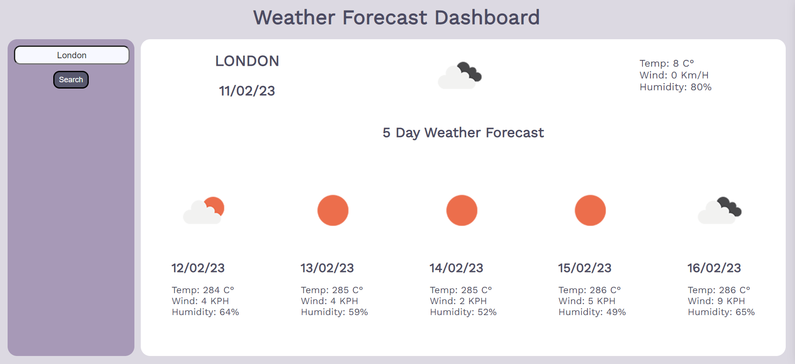

# Weather Forecast Dashboard
# Description
This application is a weather forecast dashboard. Upon entry of a city in the search bar the current weather and the five day weather forecast as well as the temperature, wind and humidity will be shown. This  application uses the open weather api, javascript, jquery and custom css. 
[Link to the deployed project](https://al946x.github.io/WeatherForecast_App/)

# Screenshot

# Installation
Clone the repo from github and run it on your local machine

